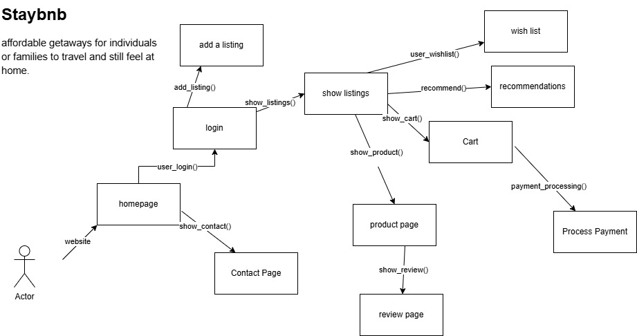

# Staybnb - Affordable Getaways for Families

## Contribution
Group 1 - Equal Contribution



## Vision Statement
Affordable getaways for families to travel and still feel at home.

---

## Features

### Functional Requirements
- **Reservation System**: Users can make or cancel reservations.
- **User Authentication**: Users can create accounts with username and password.
- **Home Listings**: View available homes with availability information.
- **Payment Integration**: Secure transaction processing.
- **Contact Page**: Access company contact details and customer service support.

### Nonfunctional Requirements
- **Security**: 99% of user accounts must be verified and secure.
- **Accessibility**: Compliant with WCAG 2.1 standards.
- **High Availability**: Website uptime must exceed 99%.
- **Performance**: Each page should load in under 2 seconds.
- **Session Management**: Users are automatically logged out after 10 minutes of inactivity.

---

## Project Structure
```
Group1-main/
├── app.py
├── config.py
├── models/
│   ├── cart.py
│   ├── listings.py
│   ├── payment.py
│   ├── review.py
│   ├── user.py
│   └── wishlist.py
├── Dockerfile
├── docker-compose.yml
├── Staybnb.jpg
└── Readme.md
```

---

## Getting Started

### Prerequisites
- Python 3.x
- Docker (optional)

### Installation
1. Clone the repo
```bash
git clone <repo_url>
cd Group1-main
```
2. Install dependencies
```bash
pip install -r requirements.txt
```

### Running the App
```bash
python app.py
```

Or use Docker:
```bash
docker-compose up --build
```

---

## License
This project is for educational use only.

